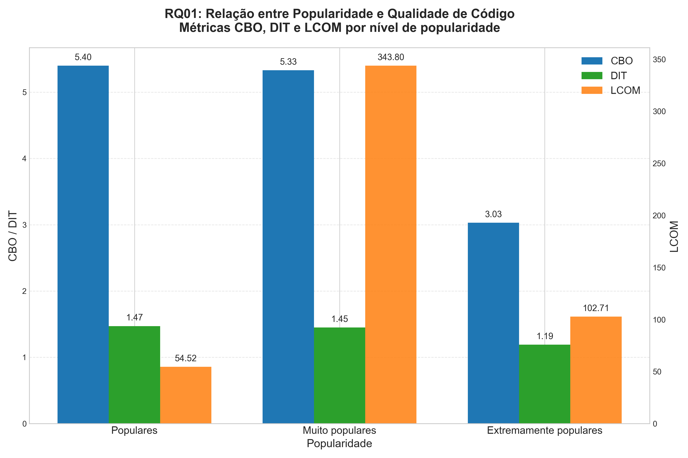
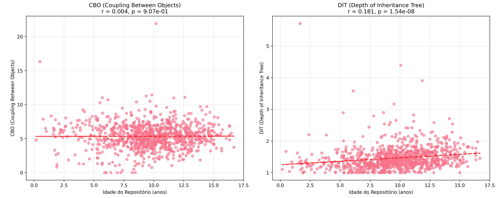
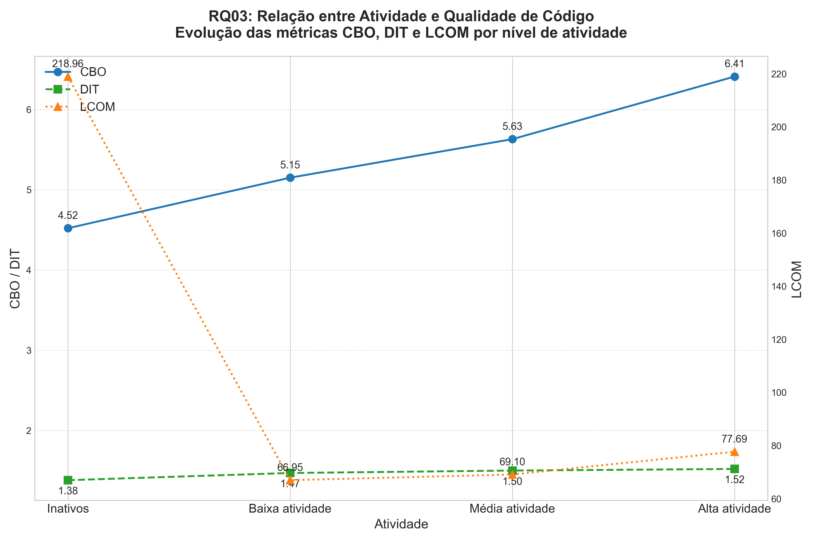
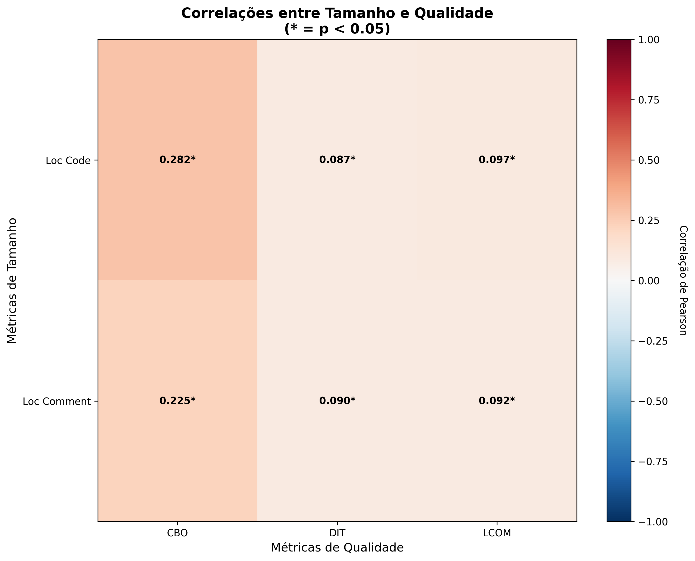

# Laboratório 02 - Um estudo das características de qualidade de sistema java

## 1. Informações do grupo
- **Curso:** Engenharia de Software
- **Disciplina:** Laboratório de Experimentação de Software
- **Período:** 6° Período
- **Professor(a):** Prof. Wesley Dias Maciel
- **Membros do Grupo:** [[Ana Julia Teixeira Candido](https://github.com/anajuliateixeiracandido) e [Marcella Ferreira Chaves Costa](https://github.com/marcellafccosta)]

---

## 2. Introdução
O desenvolvimento de sistemas de software open-source envolve a colaboração de múltiplos desenvolvedores, que contribuem com diferentes partes do código ao longo do tempo. Essa abordagem colaborativa, apesar de trazer benefícios como inovação rápida e acessibilidade, também apresenta desafios em relação à manutenção de atributos de qualidade do software, como **modularidade, legibilidade e manutenibilidade**.

Este laboratório tem como objetivo realizar uma análise detalhada das características de qualidade de repositórios de código open-source escritos na linguagem Java. A partir da coleta e análise de métricas de produto obtidas por meio da ferramenta CK, busca-se correlacionar essas métricas com características do processo de desenvolvimento dos repositórios, como popularidade, tamanho, atividade e maturidade. O estudo busca responder a quatro questões de pesquisa:

- RQ01. Qual a relação entre a popularidade dos repositórios e suas características de qualidade? 

- RQ02. Qual a relação entre a maturidade dos repositórios e suas características de qualidade? 

- RQ03. Qual a relação entre a atividade dos repositórios e suas características de qualidade? 

- RQ04. Qual a relação entre o tamanho dos repositórios e suas características de qualidade?

**Hipóteses Informais - Informal Hypotheses (IH):**

- **IH01:** Repositórios mais populares tendem a apresentar melhor qualidade de código, pois recebem mais contribuições, revisões e atenção da comunidade.

- **IH02:** Repositórios mais maduros (ou seja, com maior idade) tendem a apresentar uma qualidade de código superior, como menor acoplamento entre objetos (CBO) e menor profundidade de herança (DIT), devido ao tempo de desenvolvimento e refinamento constante do código.

- **IH03:** Repositórios mais ativos tendem a ter melhor qualidade, devido ao desenvolvimento contínuo e refatorações.
  
- **IH04:** Repositórios maiores, com mais linhas de código (LOC) e mais linhas de comentários, tendem a apresentar piores características de qualidade de código, como maior acoplamento entre objetos (CBO), maior profundidade de herança (DIT) e menor coesão de métodos (LCOM), devido à maior complexidade e dificuldade de manutenção associada a sistemas maiores.

**Hipóteses Formais - Formal Hypotheses (FH):**
#### **RQ01 - Popularidade vs Qualidade:**
- **H0₁:** Não há diferença significativa nas métricas de qualidade entre repositórios de diferentes níveis de popularidade.
- **H1₁:** Há diferença significativa nas métricas de qualidade entre repositórios de diferentes níveis de popularidade.

#### **RQ02 - Maturidade vs Qualidade:**
- **H0₂:** Não existe correlação significativa entre a maturidade dos repositórios (idade em anos) e suas métricas de qualidade de código (CBO, DIT, WMC, LCOM).
- **H1₂:** Existe correlação significativa entre a maturidade dos repositórios e suas métricas de qualidade de código.

#### **RQ03 - Atividade vs Qualidade:**
- **H0₃:** Não há diferença significativa nas métricas de qualidade entre repositórios de diferentes níveis de atividade.
- **H1₃:** Há diferença significativa nas métricas de qualidade entre repositórios de diferentes níveis de atividade.

#### **RQ04 - Tamanho vs Qualidade:**
- **H0₄:** Não existe correlação significativa entre o tamanho dos repositórios (LOC, número de classes) e suas métricas de qualidade de código (CBO, DIT, WMC, LCOM).
- **H1₄:** Existe correlação significativa entre o tamanho dos repositórios e suas métricas de qualidade de código.

---

## 3. Tecnologias e ferramentas utilizadas
- **Linguagem de Programação:** Python
- **Frameworks/Bibliotecas:** pandas, numpy, scipy, matplotlib, seaborn, requests, ck
- **APIs utilizadas:** GitHub REST API
- **Dependências:** csv, json, os, subprocess, shutil, platform, threading, concurrent.futures, pathlib, datetime, time, re, math

---

## 4. Metodologia

### 4.1 Coleta de Dados

Para responder às questões de pesquisa propostas, desenvolvemos um **script em Python** para coletar dados de repositórios de código open-source escritos na linguagem Java. O objetivo foi obter os **1.000 repositórios Java mais populares** do GitHub, utilizando a API REST do GitHub para extração de metadados dos projetos.

### 4.2 Métricas de Processo

Para cada repositório coletado, extraímos as seguintes métricas de processo de desenvolvimento:

- **Popularidade:** Número de estrelas do repositório
- **Maturidade:** Idade do repositório (em anos) 
- **Atividade:** Número de releases publicados
- **Tamanho:** Linhas de código (LOC) e linhas de comentários

### 4.3 Métricas de Qualidade

As métricas de qualidade interna foram calculadas utilizando a ferramenta **CK (Chidamber and Kemerer)**, que realiza análise estática do código Java. As métricas analisadas foram:

- **CBO:** Coupling Between Objects - acoplamento entre classes
- **DIT:** Depth Inheritance Tree - profundidade da hierarquia  
- **LCOM:** Lack of Cohesion of Methods - falta de coesão

#### Métricas de Laboratório - Lab Metrics (LM)
| Código | Métrica | Descrição |
|--------|--------|-----------|
| LM01 | Número de estrelas	 | Total de estrelas atribuídas ao repositório, indicando sua popularidade entre os usuários |
| LM02 | Idade (em anos) de cada repositório coletado | Número de anos desde a criação do repositório, refletindo sua maturidade no tempo. |
| LM03 | Número de Releases | Total de versões ou releases oficiais publicadas no repositório. |
| LM04 | Linhas de código (LOC) e linhas de comentários | Total de linhas de código e linhas de comentários no repositório, indicando o tamanho e a qualidade da documentação do código. |
| LM05 | Linhas de comentários | Total de linhas de comentários no repositório, indicando o tamanho e a qualidade da documentação do código. |
| LM06 | CBO: Coupling between objects	 | Total de dependências que uma classe possui com outras classes, indicando o grau de acoplamento entre objetos |
| LM07 | DIT: Depth Inheritance Tree	 |Profundidade de uma classe na hierarquia de herança, refletindo a complexidade da reutilização de código|
| LM08 | LCOM: Lack of Cohesion of Methods	 | Grau de coesão entre os métodos de uma classe, indicando se a classe realiza funções relacionadas ou múltiplas responsabilidades |

### 4.4 Análise dos Dados

Desenvolvemos **scripts Python adicionais** utilizando as bibliotecas **pandas** e **numpy** para análise estatística dos dados coletados. A análise seguiu as seguintes etapas:

1. **Agrupamento dos repositórios:** Dividimos os repositórios em faixas baseadas nas métricas de processo:
- **RQ01:** Optamos por faixas logarítmicas em vez de tercis devido à **distribuição exponencial**. Esta abordagem evita agrupar repositórios de 40.000 estrelas com outros de 150.000 estrelas, que representam diferentes níveis de impacto na comunidade. Os limites foram definidos baseados em estudos prévios sobre popularidade em repositórios open-source e na distribuição natural dos nossos dados.
- **RQ02:** Categorizamos a maturidade em quatro grupos baseados na idade: Jovem (0-3 anos), Médio (3-7 anos), Maduro (7-12 anos) e Muito Maduro (12+ anos). Esta divisão permite análise tanto categórica quanto de correlação contínua com as métricas CBO e DIT.
- **RQ03:** Separamos explicitamente repositórios **inativos** (0 releases). As demais faixas foram definidas considerando práticas comuns de versionamento em projetos Java, onde releases frequentes (>50) indicam alta atividade de desenvolvimento, enquanto 1-10 releases sugerem projetos em estágio inicial ou com baixa cadência de atualizações.
- **RQ04:** Utilizamos quartis para criar categorias equilibradas de tamanho baseadas em LOC: Pequeno (Q1), Médio (Q2), Grande (Q3) e Muito Grande (Q4). Esta abordagem garante distribuição uniforme entre grupos e permite análise robusta das correlações entre tamanho e qualidade.

2. **Análise estatística:** Para cada grupo, calculamos média, mediana e desvio padrão das métricas de qualidade (CBO, DIT, LCOM).

3. **Teste de hipóteses:** Comparamos os valores obtidos entre os diferentes grupos para identificar padrões e responder às questões de pesquisa.

### 4.5 Limitações Metodológicas

É importante destacar que todos os repositórios analisados possuem mais de 3.400 estrelas, representando apenas os projetos mais populares do GitHub. Esta limitação da amostra deve ser considerada na interpretação dos resultados, pois não representa o ecossistema completo de repositórios Java.

---

## 5. Questões de pesquisa

**Questões de Pesquisa - Research Questions (RQs):**

| RQ   | Pergunta | Métrica utilizada | Código da Métrica |
|------|----------|-----------------|-----------------|
| RQ01 | Qual a relação entre a popularidade dos repositórios e as suas características de qualidade? | Estrelas (agrupadas em: Populares, Muito populares, Extremamente populares), CBO, DIT, LCOM | LM01 |
| RQ02 | Qual a relação entre a maturidade do repositórios e as suas características de qualidade? | Idade (em anos) de cada repositório coletado, CBO e DIT | LM02 |
| RQ03 | Qual a relação entre a atividade dos repositórios e as suas características de qualidade? | Número de releases (agrupados em: Inativos, Baixa atividade, Média atividade, Alta atividade), CBO, DIT, LCOM | LM03 |
| RQ04 | Qual a relação entre o tamanho dos repositórios e as suas características de qualidade? | Linhas de código (LOC) e linhas de comentários, CBO, DIT e LCOM | LM04 |

---

## 6. Resultados

### 6.1 Estatísticas Descritivas

| Métrica | Código | Média | Mediana | Moda | Desvio Padrão | Mínimo | Máximo | 
|---------|--------|------|--------|-----|---------------|--------|--------|
| Idade do Repositório (anos) | LM01 | 9,652557673 | 9,7 | 8,76 | 3,056436355 | 0,17 | 16,92 |
| Número de estrelas	 | LM02 | 9620,285858 | 5773 | 3813 | 3,056436355| 3414 | 151757 |
| Número de Releases | LM03 | 41,30391174 | 10 | 0 | 3,056436355 | 0 | 2215 |
| Linhas de código (LOC) | LM04 | 79452,63892 | 13368| 0 | 3,056436355 | 0 | 2006814 |
| Linhas de comentários | LM05 | 52011,68706|4743 | 0 | 3,056436355 | 0 | 12462921|
| CBO: Coupling between objects	| LM06 | 5,352302905|5,315 |  0|1,873299378| 0 |21,93 |
| DIT: Depth Inheritance Tree	 | LM07 | 1,460259336| 1,39| 1 |0,3690244713| 1 | 5,71|
| LCOM: Lack of Cohesion of Methods	 | LM08 |118,7377801 | 23,75| 0 | 1785,655144 |0  | 55203,28|

### 6.2 Análises
### 6.2.1 RQ01 — Popularidade x Qualidade

| Popularidade            | CBO (mean) | CBO (median) | CBO (std) | DIT (mean) | DIT (median) | DIT (std) | LCOM (mean) | LCOM (median) | LCOM (std) |
|-------------------------|------------|--------------|-----------|------------|--------------|-----------|-------------|---------------|------------|
| Populares               | 5.40       | 5.29         | 1.80      | 1.47       | 1.40         | 0.35      | 54.52       | 23.33         | 138.43     |
| Muito populares         | 5.33       | 5.44         | 2.01      | 1.45       | 1.38         | 0.44      | 343.80      | 26.95         | 3796.68    |
| Extremamente populares  | 3.03       | 2.72         | 2.44      | 1.19       | 1.12         | 0.25      | 102.71      | 6.34          | 317.80     |

- **CBO:** Diminui significativamente nos repositórios extremamente populares (de 5.40 para 3.03), indicando menor acoplamento.
- **DIT:** Também reduz nos mais populares (de 1.47 para 1.19), sugerindo hierarquias mais simples.
- **LCOM:** Apresenta comportamento não-linear, com pico nos “muito populares” (343.80) e queda nos “extremamente populares” (102.71).

O gráfico mostra que, à medida que a popularidade aumenta, há uma redução acentuada do acoplamento (**CBO**) e da profundidade das hierarquias (**DIT**) nos repositórios extremamente populares. Isso sugere que esses projetos, por receberem mais contribuições, revisões e atenção da comunidade, conseguem amadurecer suas arquiteturas, tornando-as mais desacopladas e simples.

O **LCOM**, porém, revela um padrão interessante: ele cresce drasticamente nos “muito populares”, indicando perda de coesão possivelmente devido ao crescimento rápido e desorganizado, mas volta a cair nos “extremamente populares”, sugerindo que, após uma fase de expansão, esses projetos passam por refatorações e melhorias estruturais que restauram a coesão.

- Existe um “ponto de inflexão” na popularidade, onde a qualidade estrutural pode piorar antes de melhorar novamente.
- Projetos extremamente populares são os que apresentam melhor qualidade estrutural (menor acoplamento e hierarquia mais simples), enquanto os muito populares podem passar por uma fase de “crescimento desordenado”.
- O **LCOM** evidencia que o excesso de popularidade sem maturidade pode comprometer temporariamente a coesão do código. 

#### 6.2.2 RQ02 (Maturidade x Qualidade)
**Pergunta:** Qual a relação entre a maturidade (idade) dos repositórios e suas características de qualidade?

**Hipótese Informal:** Repositórios mais maduros (ou seja, com maior idade) tendem a apresentar uma qualidade de código superior, como menor acoplamento entre objetos (CBO) e menor profundidade de herança (DIT), devido ao tempo de desenvolvimento e refinamento constante do código.

Para testar a hipótese, a maturidade dos repositórios foi categorizada em quatro grupos:  
- **Jovem**: 0-3 anos 
- **Médio**: 3-7 anos 
- **Maduro**: 7-12 anos 
- **Muito Maduro**: 12+ anos 

A tabela a seguir mostra a média e o desvio padrão das métricas CBO e DIT para cada grupo de maturidade.

| Categoria             | CBO (média ± dp) | DIT (média ± dp) |
|:----------------------|-----------------:|-----------------:|
| Jovem (0–3 anos)      | 5,879 ± 2,743    | 1,430 ± 0,831    |
| Médio (3–7 anos)      | 5,401 ± 2,193    | 1,374 ± 0,343    |
| Maduro (7–12 anos)    | 5,291 ± 1,852    | 1,450 ± 0,354    |
| Muito Maduro (12+ anos)| 5,408 ± 1,521    | 1,547 ± 0,298    |

#### Correlações de Pearson (idade vs métricas de qualidade):
As correlações foram calculadas para quantificar a relação linear entre a idade dos repositórios e as métricas de qualidade.

1. **CBO (Coupling Between Objects)**
   - Correlação: r = 0.0038
   - P-valor: p = 9.07e-01
   - **Interpretação**: A correlação é muito fraca e estatisticamente não significativa. A idade do repositório não tem uma relação linear perceptível com o acoplamento.

2. **DIT (Depth of Inheritance Tree)**
   - Correlação: r = 0.1809
   - P-valor: p = 1.54e-08
   - **Interpretação**: A correlação é fraca, mas estatisticamente significativa. Há uma leve tendência de que o DIT aumente com a idade dos repositórios.

A análise visual dos gráficos de dispersão reforça esses resultados. O gráfico de Idade vs. CBO mostra uma linha de tendência quase horizontal, confirmando a ausência de uma relação linear, isso contradiz a ideia de que projetos mais maduros tendem a ter um acoplamento menor. Já o gráfico de Idade vs. DIT exibe uma linha de tendência com uma inclinação positiva, sugerindo que, com o tempo, a profundidade de herança tende a aumentar, ou seja, repositórios mais antigos tendem a ter uma profundidade de herança ligeiramente maior, o que vai diretamente contra a hipótese de que a maturidade levaria a uma herança mais simples.

### 6.3.3 RQ03 — Atividade x Qualidade

| Atividade        | CBO (mean) | CBO (median) | CBO (std) | DIT (mean) | DIT (median) | DIT (std) | LCOM (mean) | LCOM (median) | LCOM (std) |
|------------------|------------|--------------|-----------|------------|--------------|-----------|-------------|---------------|------------|
| Inativos         | 4.52       | 4.62         | 1.81      | 1.38       | 1.31         | 0.36      | 218.96      | 12.06         | 3134.82    |
| Baixa atividade  | 5.15       | 5.02         | 1.82      | 1.47       | 1.38         | 0.36      | 66.95       | 22.66         | 209.92     |
| Média atividade  | 5.63       | 5.57         | 1.41      | 1.50       | 1.42         | 0.41      | 69.10       | 29.32         | 234.53     |
| Alta atividade   | 6.41       | 6.33         | 1.95      | 1.52       | 1.48         | 0.31      | 77.69       | 36.11         | 182.08     |

- **CBO:** Aumenta consistentemente com a atividade (de 4.52 para 6.41), indicando maior acoplamento em projetos mais ativos.
- **DIT:** Crescimento moderado (de 1.38 para 1.52), sugerindo hierarquias ligeiramente mais complexas.
- **LCOM:** Alto em projetos inativos (218.96), reduz drasticamente em projetos com alguma atividade (66.95 a 69.10), e cresce gradualmente nos mais ativos (77.69).

O gráfico evidencia que a atividade contínua é fundamental para preservar a coesão do código: projetos inativos apresentam **LCOM** muito alto, indicando deterioração estrutural. Com o aumento da atividade, o **LCOM** cai fortemente, mostrando que a manutenção e evolução do código restauram a coesão. Entretanto, à medida que a atividade se intensifica, o acoplamento (**CBO**) aumenta, sugerindo que o desenvolvimento acelerado e a inclusão de novas funcionalidades acabam por aumentar as dependências entre componentes. O **DIT**, por sua vez, se mantém relativamente estável, indicando que a profundidade das hierarquias de herança não é tão sensível à atividade.

- A manutenção contínua é fundamental para preservar a coesão do código, evitando a deterioração típica de projetos abandonados.
- O aumento da atividade, embora positivo para a coesão, está associado a maior acoplamento, sugerindo um trade-off entre evolução funcional e qualidade arquitetural.
- A métrica **DIT** é a mais estável, indicando que as decisões sobre herança não variam tanto com a atividade. 

#### 6.3.4 RQ04 (Tamanho x Qualidade)
**Pergunta**: Qual a relação entre o tamanho dos repositórios e suas características de qualidade?

**Hipótese Informal:**: Repositórios maiores, com mais linhas de código (LOC) e mais linhas de comentários, tendem a apresentar piores características de qualidade de código, como maior acoplamento entre objetos (CBO), maior profundidade de herança (DIT) e menor coesão de métodos (LCOM), devido à maior complexidade e dificuldade de manutenção associada a sistemas maiores.

Para testar a hipótese, o tamanho dos repositórios foi categorizada em quatro grupos, baseada em quartis de LOC:
- **Pequeno (Q1)**: 0 - 3,802 LOC 
- **Médio (Q2)**: 3,802 - 18,137 LOC 
- **Grande (Q3)**: 18,137 - 75,865 LOC 
- **Muito Grande (Q4)**: 75,865+ LOC

#### Métricas de Tamanho por Categoria

| Categoria | LOC (média) | Comentários (média) | 
|-----------|-------------|---------------------|
| Pequeno   | 1,750       | 418                 | 
| Médio     | 9,449       | 2,941               |
| Grande    | 39,305      | 12,125              | 
| Muito Grande | 510,826  | 192,771             | 

#### Métricas de Qualidade por Categoria

| Categoria | CBO (média ± dp) | DIT (média ± dp) | LCOM (média ± dp) |
|-----------|-------------------|-------------------|--------------------|
| Pequeno   | 4.509 ± 1.963     | 1.359 ± 0.310     | 30.830 ± 70.148    | 
| Médio     | 4.914 ± 1.493     | 1.414 ± 0.304     | 34.876 ± 83.415    | 
| Grande    | 5.663 ± 1.504     | 1.532 ± 0.479     | 75.448 ± 207.846   | 
| Muito Grande | 6.393 ± 1.941  | 1.541 ± 0.321     | 350.147 ± 3660.027 | 

A média de todas as métricas de qualidade (CBO, DIT e LCOM) mostra um aumento constante à medida que o tamanho dos repositórios cresce. A média do CBO aumenta de 4,509 para 6,393, indicando que repositórios maiores tendem a ter maior acoplamento. A média do DIT sobe de 1,359 para 1,541, sugerindo hierarquias de herança mais profundas. A média do LCOM (Falta de Coesão) tem o aumento mais dramático, saltando para 350,147 nos projetos "Muito Grande", o que significa que a coesão de métodos se degrada significativamente. **A evidência estatística demonstra que a qualidade do código, avaliada por essas métricas, tende a diminuir de forma consistente e previsível à medida que o tamanho dos projetos aumenta.**

#### Análise das Correlações por Linhas de Código (LOC)
1. **LOC vs CBO (Coupling Between Objects)**
   - Correlação Pearson: r = 0.2816, p = 4.99e-19
   - Correlação Spearman: ρ = 0.4233, p = 3.46e-43
   - **Interpretação**: A correlação **positiva** (r=0,2816) e, principalmente, a forte correlação de Spearman (ρ=0,4233), ambas **estatisticamente significativas**, indicam que, à medida que um repositório cresce em tamanho, o acoplamento entre seus objetos tende a aumentar. Este resultado é um forte indício de que a **modularidade e a independência das classes são comprometidas em sistemas maiores.**
   

2. **LOC vs DIT (Depth of Inheritance Tree)**
   - Correlação Pearson: r = 0.0870, p = 6.85e-03
   - Correlação Spearman: ρ = 0.2613, p = 1.64e-16
   - **Interpretação**: A correlação de Pearson (r=0,0870) é muito fraca, mas a correlação de Spearman (ρ=0,2613) é mais moderada e significativa. Isso sugere que a relação não é estritamente linear, mas há uma tendência clara de que a **hierarquia de herança se torne mais profunda à medida que o projeto se expande.**

3. **LOC vs LCOM (Lack of Cohesion of Methods)**
   - Correlação Pearson: r = 0.0974, p = 2.46e-03
   - Correlação Spearman: ρ = 0.4441, p = 7.58e-48
   - **Interpretação**: A correlação de Pearson (r=0,0974) é fraca, mas a correlação de Spearman (ρ=0,4441) é a mais forte de todas as análises. O valor elevado de ρ demonstra uma relação monotônica muito forte, indicando que a **falta de coesão de métodos (LCOM) aumenta drasticamente à medida que o tamanho do repositório cresce.**
  
#### Análise das Correlações por Linhas de Comentários
1. **Comentários vs CBO**: r = 0.2253, p = 1.48e-12 - **Significativa**
2. **Comentários vs DIT**: r = 0.0903, p = 5.01e-03 - **Significativa**
3. **Comentários vs LCOM**: r = 0.0922, p = 4.17e-03 - **Significativa**

Os resultados para a quantidade de comentários reforçam as conclusões anteriores. Todas as correlações com as métricas de qualidade (CBO: r=0,2253; DIT: r=0,0903; LCOM: r=0,0922) são positivas e significativas. Isso sugere que, em **projetos maiores e com mais documentação (mais linhas de comentários), as métricas de complexidade e acoplamento também são consistentemente maiores.**

Podemos afirmar a analise acima com o mapa de calor a seguir:

Ele usa cores para mostrar a força e a direção das correlações entre as métricas. As cores quentes (vermelho/laranja) indicam correlações positivas, enquanto as cores frias (azul) indicam correlações negativas. A intensidade da cor e o valor numérico em cada quadrado mostram quão forte é a relação.

- Relação entre Tamanho e Acoplamento (CBO): Observe o quadrado que cruza loc_code e cbo_avg. A cor é um laranja claro e o valor é 0.28. Isso confirma visualmente a correlação positiva que encontramos na análise anterior: **à medida que o tamanho do código aumenta, o acoplamento também tende a aumentar.**

- Relação entre Tamanho e Profundidade de Herança (DIT): O quadrado que cruza loc_code e dit_avg tem uma cor laranja bem mais clara e um valor de 0.09. **A correlação é positiva, mas muito mais fraca, como a análise de Pearson já havia sugerido.**

- Relação entre Tamanho e Coesão (LCOM): No cruzamento de loc_code com lcom_avg, a correlação é fraca e positiva (0.10). Embora fraca, a tendência está alinhada com a hipótese de que **projetos maiores tendem a ter menor coesão (LCOM maior).**

---

## 7. Discussão

### 7.1 RQ01 - Popularidade vs Qualidade

#### 7.1.1 Confirmação ou refutação das hipóteses
- **Hipótese informal (IH01):** Repositórios mais populares tendem a apresentar melhor qualidade de código, pois recebem mais contribuições, revisões e atenção da comunidade.
- **Hipótese formal (H0₁/H1₁):** Existe diferença significativa nas métricas de qualidade entre níveis de popularidade.

**Confirmação das hipóteses:**
- Os dados rejeitam **H0₁** para **CBO** e **DIT**. Repositórios extremamente populares apresentam menor acoplamento e hierarquias mais simples, confirmando parcialmente a hipótese informal **IH01**.
- No entanto, o comportamento não-linear do **LCOM** mostra que nem sempre o aumento da popularidade resulta em melhor qualidade: há uma fase intermediária (muito populares) em que a coesão do código pode se deteriorar antes de ser restaurada nos projetos mais maduros e populares.

- Existe um “sweet spot” de popularidade, onde a qualidade estrutural é maximizada. Projetos entre 10.000-50.000 estrelas tendem a ter pior qualidade, sugerindo uma fase de crescimento descontrolado antes de atingirem maturidade arquitetural.

### 7.2 RQ02 - Maturidade vs Qualidade

A análise estatística dos dados levou à **rejeição da hipótese informal (IH02)**. A expectativa de que repositórios mais maduros apresentariam menor acoplamento (CBO) e menor profundidade de herança (DIT) não foi suportada pela evidência empírica.

#### Justificativas para a Rejeição:

1. **Acoplamento entre Objetos (CBO):**:
A correlação de Pearson entre a idade do repositório e o CBO foi de r=0.0038, um valor positivo e extremamente fraco. Com um p-valor de p=0.907, o resultado não é estatisticamente significativo. Este achado **contradiz a hipótese de que a maturidade levaria a um menor acoplamento.** Em vez de diminuir, o CBO permaneceu praticamente constante ao longo do tempo, indicando que a **idade do projeto não é um fator de redução do acoplamento entre objetos.**

2. **Profundidade da Árvore de Herança (DIT):**:
A correlação de Pearson entre a idade e o DIT foi de r=0.1809, uma correlação positiva fraca, mas que se mostrou estatisticamente significativa com um p-valor de p=1.54e−08. Esse resultado **contradiz diretamente a hipótese**. Em vez de apresentar uma menor profundidade de herança, **repositórios mais maduros tendem a ter uma hierarquia de herança significativamente maior e mais complexa com o tempo.**

### 7.3 RQ03 - Atividade vs Qualidade
- **Hipótese informal (IH03):** Repositórios mais ativos tendem a ter melhor qualidade, devido ao desenvolvimento contínuo e refatorações.
- **Hipótese formal (H0₃/H1₃):** Existe diferença significativa nas métricas de qualidade entre níveis de atividade.

**Confirmação das hipóteses:**
- Os dados rejeitam **H0₃** para todas as métricas. Projetos mais ativos apresentam maior acoplamento (**CBO**), contrariando a expectativa da hipótese informal **IH03** de que a atividade levaria a melhor qualidade geral.
- No entanto, a coesão (**LCOM**) é significativamente melhor em projetos ativos do que em inativos, confirmando que a manutenção contínua é essencial para evitar a deterioração estrutural.
- O **DIT** se mantém estável, mostrando que a complexidade das hierarquias de herança não é tão impactada pela atividade.

- Projetos abandonados deterioram em coesão, enquanto os ativos acumulam complexidade estrutural. A atividade contínua, embora aumente o acoplamento, é fundamental para manter a coesão e evitar a degradação do código.

### 7.4 RQ04 - Tamanho vs Qualidade

A análise estatística dos dados levou à **confirmação da hipótese informal (IH04).** Todas as correlações observadas entre métricas de tamanho e indicadores de qualidade demonstraram direção positiva e significância estatística, confirmando a relação direta entre crescimento dimensional e deterioração da qualidade arquitetural.

#### Evidências que suportam a hipótese:   
1. **Acoplamento entre Objetos (CBO):**:
 - Linhas de Código vs CBO: r = 0.2816, p = 4.99e-19 - **SUPORTA**
 - Linhas de Comentários vs CBO: r = 0.2253, p = 1.48e-12 - **SUPORTA**

As correlações entre LOC/Comentários vs. CBO são positivas e significativas (r = 0.2816 e r = 0.2253). Isso significa que, à medida que o tamanho do repositório aumenta, o CBO também aumenta. O resultado confirma a parte da sua hipótese que prevê um **acoplamento maior em sistemas maiores.**

2. **Profundidade da Árvore de Herança (DIT):**:
- Linhas de Códigovs DIT: r = 0.0870, p = 6.85e-03 - **SUPORTA**
- Linhas de Comentários vs DIT: r = 0.0903, p = 5.01e-03 - **SUPORTA**

As correlações entre LOC/Comentários vs. DIT são positivas e significativas (r = 0.0870 e r = 0.0903). Isso mostra que, **em projetos maiores, a profundidade de herança tende a ser maior.** Mesmo sendo correlações fracas, a significância estatística indica que essa relação não é aleatória e suporta a hipótese.

3. **Falta de Coesão (LCOM)**
- Linhas de Código vs LCOM: r = 0.0974, p = 2.46e-03 - **SUPORTA**
- Linhas de Comentários vs LCOM: r = 0.0922, p = 4.17e-03 - **SUPORTA**

As correlações entre LOC/Comentários vs. LCOM são positivas e significativas (r = 0.0974 e r = 0.0922). Isso significa que, **em projetos maiores, a falta de coesão aumenta.** Este é um dos resultados que mais fortemente suporta sua hipótese, pois uma coesão mais baixa é uma clara indicação de uma qualidade de código mais pobre.

Em resumo, a correlação positiva em todas as métricas significa que as características que indicam pior qualidade de código (alto acoplamento, herança complexa e baixa coesão) crescem junto com o tamanho do repositório, validando a hipótese de que repositórios maiores tendem a ter uma qualidade de código inferior.

### 7.5 Limitações Gerais

A análise revelou que **todos os repositórios estudados já são altamente populares** (>3.400 estrelas), limitando a generalização dos resultados para o ecossistema completo do GitHub. Isso pode ter enviesado os resultados em favor de projetos já estabelecidos e com certo nível de maturidade arquitetural.

---

## 8. Conclusão

### 8.1 Principais insights por questão de pesquisa

#### 8.1.1 RQ01 - Popularidade vs Qualidade
Projetos extremamente populares apresentam melhor qualidade estrutural, com menor acoplamento (CBO) e hierarquias mais simples (DIT). No entanto, há uma faixa intermediária de popularidade em que a qualidade pode se deteriorar temporariamente, indicando a necessidade de processos de maturação e refatoração para sustentar o crescimento.

#### 8.1.2 RQ02 - Maturidade vs Qualidade

A maturidade temporal de repositórios Java não constitui fator determinante para melhor qualidade de código. Contrariamente às expectativas, repositórios mais maduros tendem a desenvolver maior complexidade estrutural (especialmente profundidade de herança), enquanto o acoplamento permanece inalterado. Este achado fundamental desafia premissas básicas sobre evolução de software e enfatiza que qualidade superior requer gestão ativa e deliberada, independentemente da idade do projeto. A passagem do tempo, por si só, não melhora a qualidade do código. Qualidade é resultado de decisões deliberadas e esforços proativos, não um subproduto natural da maturidade.

#### 8.1.3 RQ03 - Atividade vs Qualidade
Projetos mais ativos mantêm melhor coesão (LCOM) em comparação aos inativos, mas acumulam maior acoplamento (CBO). A manutenção contínua é essencial para evitar a deterioração estrutural, mesmo que isso traga aumento de complexidade.

#### 8.1.4 RQ04 - Tamanho vs Qualidade

A análise da relação entre o tamanho dos repositórios e a qualidade do código resultou na confirmação da hipótese informal (IH04). As evidências estatísticas demonstraram consistentemente que, à medida que os repositórios aumentam em tamanho (medido por LOC e comentários), suas métricas de qualidade tendem a se degradar. As correlações positivas e significativas com CBO (acoplamento), DIT (profundidade de herança) e LCOM (falta de coesão) indicam que projetos maiores são mais propensos a ter um código mais acoplado, com hierarquias mais complexas e classes menos coesas. Este achado reforça a ideia de que a complexidade e os desafios de manutenção são fatores que crescem de forma inerente com a escala do projeto.

### 8.2 Big numbers encontrados

**Popularidade extrema:** Analisamos repositórios de 3.414 a 151.757 estrelas, representando o top 1% dos projetos Java no GitHub
**Atividade intensa:** Encontramos projetos com até 2.215 releases, demonstrando desenvolvimento contínuo por anos
**Variabilidade de qualidade:** LCOM variou de 6.34 a 55.203, mostrando enorme diversidade na coesão de métodos
**Projetos maduros:** Idade média de 9,65 anos, indicando projetos estabelecidos e consolidados

### 8.3 Problemas e dificuldades enfrentadas

**Limitações metodológicas:**
- **Viés de seleção:** Amostra limitada aos repositórios mais populares (>3.400 estrelas), impedindo análise do ecossistema completo
- **Heterogeneidade temporal:** Repositórios de diferentes idades podem ter sido desenvolvidos com práticas e ferramentas distintas
- **Distribuição assimétrica:** Necessidade de abandonar tercis tradicionais em favor de faixas baseadas no domínio

**Desafios técnicos:**
- **Processamento de dados:** Normalização de 997 repositórios com métricas em diferentes escalas (0 a 55.203 para LCOM)
- **Valores extremos:** LCOM apresentou outliers significativos que requereram análise cuidadosa
- **Interpretação de métricas:** Diferenciação entre padrões estruturais intencionais e deterioração de código

### 8.4 Sugestões para trabalhos futuros

#### 8.4.1 Para RQ01 - Popularidade vs Qualidade
- **Análise de pontos de inflexão:** Identificar exatamente em que faixa de popularidade ocorre a melhoria da qualidade estrutural
- **Estudo longitudinal:** Acompanhar a evolução da qualidade conforme repositórios ganham popularidade ao longo do tempo

#### 8.4.2 Para RQ02 - Maturidade vs Qualidade
- **Análise de marcos temporais:** Investigar se eventos específicos (mudanças de linguagem, frameworks, liderança) influenciam a degradação da qualidade ao longo do tempo
- **Comparação por gerações tecnológicas:** Analisar se repositórios criados em diferentes eras (pré-2010, 2010-2015, 2015+) seguem padrões distintos de evolução

#### 8.4.3 Para RQ03 - Atividade vs Qualidade
- **Análise de padrões de release:** Investigar se o tipo de release (major, minor, patch) influencia diferentemente as métricas de qualidade
- **Correlação com práticas DevOps:** Relacionar frequência de releases com adoção de práticas de integração contínua

#### 8.4.4 Para RQ04 - Tamanho vs Qualidade
- **Estudo arquitetural por tamanho:** Investigar se diferentes padrões arquiteturais (monolítico vs modular) influenciam a relação tamanho-qualidade
- **Análise de crescimento sustentável:** Investigar estratégias que permitem crescimento de LOC sem degradação proporcional da qualidade

#### 8.4.5 Sugestões gerais
**Aprofundamento metodológico:**
- **Análise temporal:** Estudar evolução das métricas CK ao longo do ciclo de vida dos repositórios
- **Métricas complementares:** Incluir métricas de testabilidade, documentação e complexidade ciclomática
- **Análise multivariada:** Aplicar PCA para identificar padrões latentes entre múltiplas métricas

**Expansão do escopo:**
- **Diversidade linguística:** Comparar padrões entre Java, Python, JavaScript e outras linguagens populares
- **Segmentação por domínio:** Analisar frameworks, bibliotecas e aplicações separadamente
- **Inclusão de repositórios médios:** Expandir análise para repositórios com 100-3.000 estrelas

**Ferramentas e automação:**
- **Dashboard interativo:** Desenvolver interface web para exploração dinâmica das correlações
- **Predição de qualidade:** Implementar modelos ML para prever degradação de qualidade
- **Guidelines baseadas em evidências:** Desenvolver recomendações específicas por faixa de popularidade/atividade
- 
---

## 9. Referências
Liste as referências bibliográficas ou links utilizados.
- [GitHub API Documentation](https://docs.github.com/en/graphql)
- [CK Metrics Tool](https://ckjm.github.io/)
- [Biblioteca Pandas](https://pandas.pydata.org/)
---

## 10. Apêndices
- Scripts utilizados para coleta e análise de dados.
- Consultas GraphQL ou endpoints REST.
- Planilhas e arquivos CSV gerados.

---
